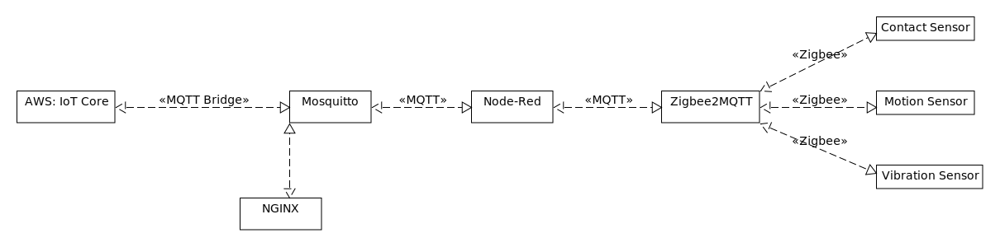

## Introduction
The following stack of technologies enables our company to deploy remote Zigbee IoT Gateways at our client's facilities. We provision Zigbee end-devices and routers throughout a facility and connect them to our Zigbee coordinator software (zigbee2mqtt). We then extract / transform the raw payloads (node-red) and publish them to our AWS environment (mosquitto). We leverage GUI interfaces provided by node-red and zigbee2mqtt for managing the stack after deployment (nginx).

We've built a B2B Enterprise IoT Product with this stack of technologies + balena serving as our "edge gateway". We wish you the best of luck in your journey :)

## Architecture

## Requirements
* Zigbee2MQTT requires a Zigbee Adapter to function -- https://www.zigbee2mqtt.io/guide/adapters/
* MosquittoMQTT requires "AWS IoT Core - End Point" + "AWS IoT Core - Certificates" to bridge payloads to AWS environment -- see "/config/mosquitto.conf" & "/certs/" repectively.

## Usage
* Manage your Zigbee devices via Zigbee2MQTT = https://$YOURDEVICEPUBLICURL.balena-devices.com/z2m
* Write your Node-Red flows = https://$YOURDEVICEPUBLICURL.balena-devices.com/

## Technologies in stack
* https://github.com/Koenkk/zigbee2mqtt
* https://github.com/node-red/node-red
* https://github.com/nginx/nginx
* https://github.com/eclipse/mosquitto
### Password
* admin:881000xXx

